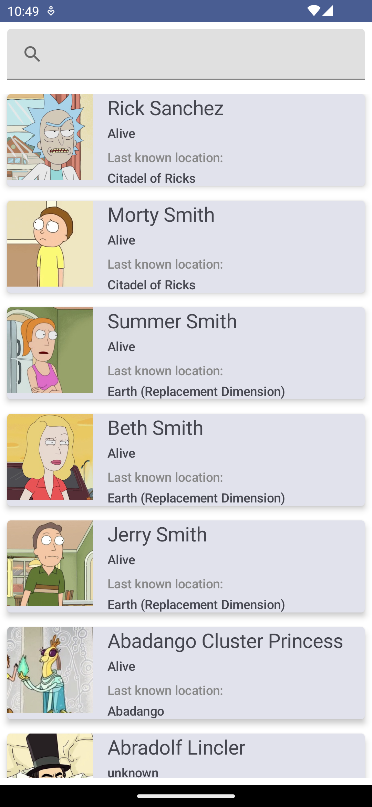

# Rick and Morty API Android Project

This Android project is a simple application that fetches data from the _Rick and Morty API_ and
displays it on the screen. The project uses Kotlin as the main programming language and makes use of
Retrofit and Moshi libraries to consume the API and parse the JSON response.

## Requirements

    Android Studio Arctic Fox or higher
    Kotlin 1.5.30 or higher
    Retrofit 2.9.0 or higher
    Moshi 1.14.0 or higher

## Getting Started

    1. Clone the repository using the following command:

       git clone https://github.com/MaasboDev/rick-and-morty.git

    2. Open the project in Android Studio.
    3. Build and run the project.

## Features

The following features are implemented in the application:

    Display a list of characters from the API.
    Show details of each character such as name, status, species, gender, origin, location and image.

## Architecture

The project follows the Model-View-ViewModel (MVVM) architecture pattern. The components of the architecture are as follows:

* **Model**: The data model that defines the structure of the API response.
* **View**: The UI components that display the data to the user.
* **ViewModel**: The intermediary between the Model and the View. It retrieves data from the Model
  and provides it to the View for display.

## API Endpoints Used

The following API endpoints are used in the project:

* **https://rickandmortyapi.com/api/character**: Get a list of all characters.
* **https://rickandmortyapi.com/api/character/{id}**: Get details of a specific character.

## Libraries Used

The following libraries are used in the project:

* **Arrow**: Arrow is composed of different libraries that greatly improve your developer experience using Kotlin, here is used to efficiently handling errors.
* **Hilt**: Hilt provides a standard way to incorporate Dagger dependency injection into an Android application.
* **Mockk**: For testing.
* **Moshi**: A modern JSON library for Android, Java and Kotlin. It makes it easy to parse JSON into Java and Kotlin classes.
* **Navigation Component**: Provides support for Jetpack Compose applications. You can navigate between composables while taking advantage of the Navigation component’s infrastructure and features.
* **Paging**: The Paging library helps you load and display pages of data from a larger dataset from local storage or over network.
* **Retrofit**: A type-safe HTTP client for Android and Java.
* **Room**: Provides an abstraction layer over SQLite to allow for more robust database access while harnessing the full power of SQLite.

## Screenshots

    

## License

This project is licensed under the Apache License. See the _LICENSE_ file for more details.
